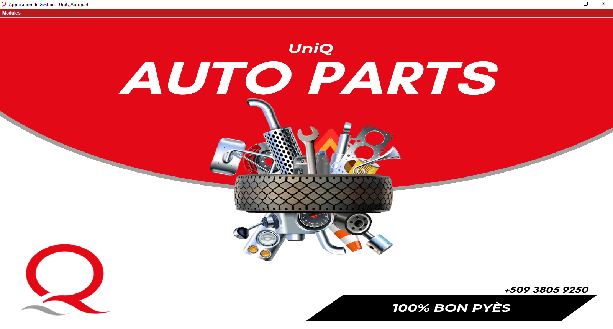

# 🧾 Inventory & Sales Management System (Java Swing + MySQL)

A desktop application for managing parts inventory, employees, and daily sales reporting with profit calculations. Built with **Java Swing** for the UI and **MySQL** as the database engine, this system is ideal for small retail or hardware stores looking for a simple, effective way to handle operations.

---

## 🚀 Features

- 🧰 **Parts Management**
  - Add, update, delete, and search for parts
  - View all parts or sort them alphabetically
  - Auto-generated part IDs (non-editable)

- 👥 **Employee Management**
  - Full CRUD operations on employees
  - Auto-generated employee IDs
  - Editable salary, contact and position fields

- 💸 **Sales Processing**
  - Create a new sale with multiple line items
  - Automatically updates inventory quantities
  - Saves transaction with timestamp and client information

- 📊 **Sales Reporting**
  - Generate daily sales reports by date selection
  - Displays total purchase cost, sales revenue, and profit
  - Real-time table generation and summaries

- 🖼️ **User Interface**
  - Clean and consistent design with red/gray theming
  - Modular MDI (Multi Document Interface) layout

---

## 🛠️ Technologies Used

- **Java (Swing/AWT)**
- **MySQL** (JDBC connectivity)
- **VS Code** compatible
- **DbUtils** (for ResultSet to JTable conversion)

---

## 📸 Screenshots

| Parts Module | Sales Report | Employee Management |
|--------------|--------------|---------------------|



---

## ⚙️ How to Run

1. **Clone the repository**
   ```bash
   git clone https://github.com/mrcocktail/inventory-sales-system.git

2. **Set up the database**
Import the provided .sql schema (not included here)
Update the Connexion.java file with your MySQL credentials

3. **Compile and run**
```bash
    javac *.java
    java App
```

Use your preferred IDE or command line:

## 🧠 Known Limitations / To-Do
No authentication yet (multi-user login planned)
Reporting could be extended to monthly/weekly
PDF export of sales reports
Input validation enhancements


Built with 💻, ☕, and a lot of persistence.

David Bruno